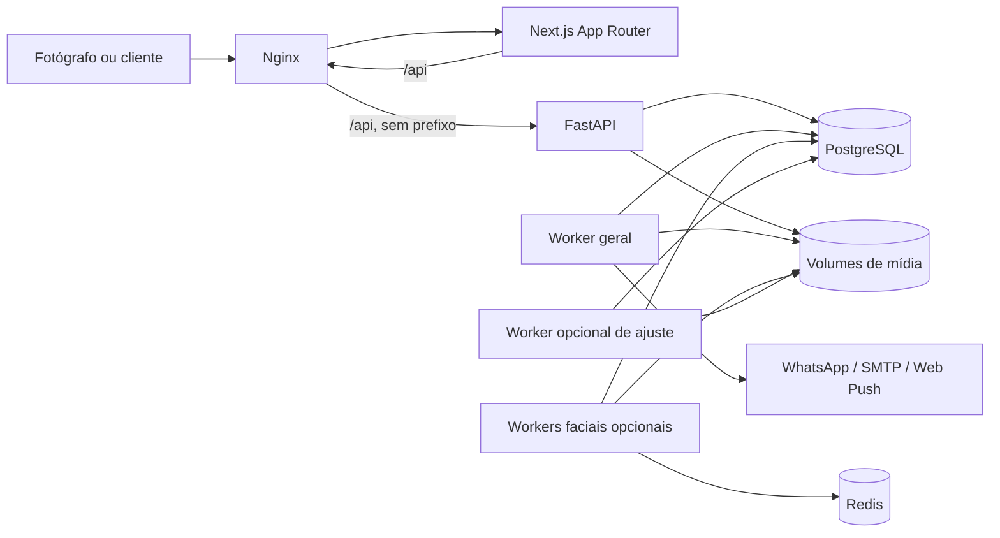

# Inventário técnico do Pick-your-Pic

Estado observado no repositório em 25/09/2026. Este é um retrato técnico, não uma proposta de implementação nem uma certificação da instalação em produção. A implementação é a referência para afirmar que algo existe; [OpenSpec](openspec/config.yaml), [roadmap](ROADMAP_ARQUITETURA.md) e [instruções operacionais](INSTRUCOES_EXECUTOR_CLAUDE_CODE.md) registram requisitos e decisões, que podem estar adiante do código. Não foram examinados dados reais, segredos, volumes nem recursos do servidor.

## 1. Visão geral

O Pick-your-Pic é uma aplicação self-hosted para um fotógrafo administrar galerias, disponibilizar fotografias a clientes/responsáveis, receber seleções e conduzir vendas. O MVP descrito no [roadmap](ROADMAP_ARQUITETURA.md) pressupõe um administrador fotógrafo. O cliente entra com identidade/telefone e OTP, recebe acesso às galerias às quais está vinculado, visualiza prévias protegidas, seleciona ou favorita fotos, pode comprar e acompanhar pedidos. O fotógrafo gerencia clientes, galerias públicas e privadas, pastas, arquivos, preços, pagamentos, entregas, comunicação e estatísticas. A UI se divide entre entrada pública, biblioteca/galerias do cliente e painel `/admin` ([rotas](frontend/app), [API](backend/app/main.py)).

Os percursos centrais são: cadastro/acesso → galeria → seleção/carrinho → PIX manual → confirmação → entrega; e administração → galeria/pasta/upload → geração de prévia → publicação/convite → acompanhamento da venda. Há busca facial protegida sob política e rollout próprios, não uma grade pública irrestrita ([módulos faciais](backend/app/facial), [OpenSpec](openspec/specs)).

## 2. Arquitetura atual

| Camada | Estado no código | Evidência |
| --- | --- | --- |
| Frontend | Next.js 16, React 19, TypeScript, App Router; telas de cliente/admin, CSS e testes Vitest. O navegador consome a API via `/api`. | [package.json](frontend/package.json), [app](frontend/app) |
| Entrada HTTP | Nginx é a única porta publicada no Compose; `/api/` é reescrito para a API, `/` vai ao Next; `/api/internal/` é bloqueado publicamente. | [nginx.conf](docker/nginx/nginx.conf), [Compose](docker/docker-compose.yml) |
| Backend | FastAPI + SQLAlchemy 2/Pydantic; grande superfície de rotas em `main.py`, com regras também separadas em módulos de domínio. | [main.py](backend/app/main.py), [app](backend/app) |
| Persistência | PostgreSQL 17 no Compose; Alembic aplica migrations antes da API/worker. A configuração de desenvolvimento aceita SQLite local. | [auth.py](backend/app/auth.py), [migrations](backend/migrations/versions), [Compose](docker/docker-compose.yml) |
| Mídia | Originais, derivados, histórico comercial, branding e referências faciais têm raízes/volumes separados; prévias protegidas e marcas d'água são produzidas pelo backend. | [media.py](backend/app/media.py), [Compose](docker/docker-compose.yml) |
| Trabalho assíncrono | Worker geral faz polling de trabalhos persistidos no banco; workers faciais opcionais usam banco durável com Redis para despertar; ajuste opcional de prévias tem worker próprio. | [worker.py](backend/app/worker.py), [facial/jobs.py](backend/app/facial/jobs.py), [override](docker/docker-compose.preview-adjustment.yml) |
| Integrações | WhatsApp via sandbox ou Evolution API; e-mail via sandbox ou SMTP; Web Push com VAPID; link do Google Photos é informado manualmente e validado, sem API de criação de álbum. PIX é manual. | [messaging.py](backend/app/messaging.py), [email_delivery.py](backend/app/email_delivery.py), [web_push.py](backend/app/web_push.py), [order_delivery.py](backend/app/order_delivery.py), [pix.py](backend/app/pix.py) |
| Operação | Compose `markina-gallery` com Nginx, web, API, migration, PostgreSQL, Redis e worker; perfis opcionais `whatsapp-real`, `facial`, `bootstrap` e `preview-adjustment`. | [Compose](docker/docker-compose.yml), [override](docker/docker-compose.preview-adjustment.yml) |

O Redis principal está configurado com AOF e volume persistente. A Evolution API, quando habilitada, possui seu próprio PostgreSQL e Redis, distintos do banco principal. O perfil facial agrega workers de busca, indexação e manutenção; o override de ajuste de prévias depende de habilitação explícita. Serviços e volumes são locais ao projeto Compose, sem armazenamento de objetos distribuído demonstrado. A rede `npm` integra a entrada externa compartilhada; infraestrutura física, capacidade e configuração efetiva de cada ambiente estão **NÃO DETERMINADO — necessita investigação/benchmark**. Referências: [Compose](docker/docker-compose.yml), [DEPLOY.md](DEPLOY.md).

## 3. Funcionalidades implementadas

| Área | Funcionamento e componentes principais |
| --- | --- |
| Identidade e acesso | Login administrativo com senha Argon2/TOTP, recuperação de conta e gestão de sessão; cliente com nome/telefone/OTP via WhatsApp; papéis e vínculos conferidos no servidor. [auth.py](backend/app/auth.py), [admin_security.py](backend/app/admin_security.py), [tela inicial](frontend/app/page.tsx). |
| Clientes/galerias | Cadastro e telefones; galeria matriz, pastas e fotos; galerias derivadas por cliente, membros, convite/capacidade, bloqueio, renovação e ciclo de vida. [main.py](backend/app/main.py), [gallery_access.py](backend/app/gallery_access.py), [private_membership.py](backend/app/private_membership.py), [painel](frontend/app/admin). |
| Mídia | Upload de originais, derivados e prévias com marca d'água, proteção de visualização, capas e histórico de mídia associada a vendas; remoção controlada por jobs. [media.py](backend/app/media.py), [asset_removal.py](backend/app/asset_removal.py), [historical_media.py](backend/app/historical_media.py). |
| Prova e interação | Biblioteca do cliente, seleção, favoritos, comentários, revisão e pastas; experiência de galeria privada ou pública condicionada a autorização. [galeria](frontend/app/gallery), [biblioteca](frontend/app/library), [main.py](backend/app/main.py). |
| Comercial | Regras/presets de preço, carrinho unificado, pedido e itens, agrupamento de pagamentos, PIX manual, comunicações/ajustes de pagamento, acompanhamento de compras. [checkout.py](backend/app/checkout.py), [pricing.py](backend/app/pricing.py), [client_commerce.py](backend/app/client_commerce.py), [main.py](backend/app/main.py). |
| Entrega | Fotógrafo registra link compartilhável do Google Photos em pedido e pode reenviar aviso; cliente consulta entrega pelo pedido/biblioteca. A aplicação não cria álbum remotamente. [order_delivery.py](backend/app/order_delivery.py), [main.py](backend/app/main.py). |
| Mensagens | Configuração por evento, preferências Web Push/WhatsApp, templates, outboxes e tentativas de entrega; notificações de pagamento, associação/reabertura, entrega e outros eventos. [notification_settings.py](backend/app/notification_settings.py), [notification_delivery.py](backend/app/notification_delivery.py), [worker.py](backend/app/worker.py), [UI](frontend/app/admin/notifications). |
| Busca facial | Política, autorização/representação, captura de referência, indexação, busca, calibração, retenção e observabilidade; depende de rollout e configuração opcional. [facial](backend/app/facial), [Compose](docker/docker-compose.yml). |
| Operação do fotógrafo | Branding, estatísticas e exportações, monitoramento de armazenamento, configurações de canal WhatsApp/PIX/segurança e operações de manutenção. [admin](frontend/app/admin), [main.py](backend/app/main.py). |

Esta tabela descreve a existência de fluxos no código, não certifica que provedores externos estejam configurados ou que todo fluxo esteja habilitado em um ambiente específico.

## 4. Banco, relações e dados persistentes

Os modelos SQLAlchemy estão concentrados em [auth.py](backend/app/auth.py). As migrations Alembic ficam em [backend/migrations/versions](backend/migrations/versions); a última versão presente nesta inspeção é `20260925_0061_order_delivery.py`. O serviço `migrate` executa `alembic upgrade head` antes da inicialização da API/worker ([Compose](docker/docker-compose.yml)).

| Grupo | Tabelas/modelos representativos | Relação e crescimento relevante |
| --- | --- | --- |
| Pessoas e sessões | `admin_user`, `client`, `client_phone`, `auth_challenge`, `auth_session`, `audit_event`, desafios/tokens administrativos | Sessões e auditoria crescem com acessos/tentativas; clientes têm múltiplos telefones e vínculos. |
| Galerias e fotos | `parent_gallery`, `photo_folder`, `photo_asset`, `parent_gallery_registration`, `derived_gallery`, `derived_gallery_membership`, `derived_gallery_photo`, `derived_gallery_photo_origin`, `gallery_access`, `gallery_access_capability` | Matriz → pastas → fotos; derivada pertence a uma matriz e vincula clientes/fotos. Muitos arquivos e associações multiplicam linhas e volume externo ao banco. |
| Interação e vendas | `photo_selection`, `photo_favorite`, `photo_view`, `photo_comment`, `sale_order`, `sale_order_item`, `payment_group`, regras/presets de preço e comunicações de pagamento | Interações por cliente/foto; pedido e itens ligados ao cliente/galeria; histórico comercial retém referências à mídia. |
| Entrega e comunicação | `notification_setting`, `notification_milestone`, `notification_event`, `notification_delivery`, `push_subscription`, outboxes, `whatsapp_delivery`/`whatsapp_delivery_attempt`, `email_delivery`/`email_delivery_attempt`, `whatsapp_webhook_receipt` | Volume acompanha eventos, assinaturas, tentativas e retries. Algumas configurações são globais ao operador. |
| Jobs e mídia | `media_derivative`, `media_job`, `private_upload_batch`, `private_upload_batch_asset`, `asset_file_cleanup`, operações de ciclo de vida e `commercial_history_media` | Volume cresce com fotos, derivados, lotes, histórico e reprocessamentos. Bytes ficam principalmente nos volumes, não nessas tabelas. |
| Facial | Política/rollout/calibração/representação, `photo_analysis`, `photo_face_embedding`, `facial_search_request`, candidatos/snapshots/jobs/outbox | Volume, CPU e retenção dependem da habilitação, número de fotos/rostos e buscas. Há dados sensíveis sujeitos a política própria. |

Existem outras tabelas de configuração, correção e retenção no mesmo módulo. Não há cardinalidade real, tamanho atual, taxa de crescimento ou plano de execução SQL medidos neste inventário: **NÃO DETERMINADO — necessita investigação/benchmark**. Índices/constraints estão em modelos e migrations, mas sua adequação a centenas/milhares de clientes exige planos de consulta e carga representativa. Pontos a medir: listagem de galerias/fotos, montagem de biblioteca e histórico, agregação de estatísticas, seleção/carrinho e polling de outboxes/jobs ([main.py](backend/app/main.py), [worker.py](backend/app/worker.py)).

Persistência física: `pgdata`, `redisdata`, `media-source`, `media-derivatives`, `media-history`, `branding-assets`, `facial-references` e, no perfil WhatsApp real, volumes de instância/banco/Redis da Evolution ([Compose](docker/docker-compose.yml)). Não houve inspeção ou limpeza desses volumes.

## 5. Fluxos críticos ponta a ponta

1. **Autenticação do cliente:** formulário → `/api/auth/client/challenge` → desafio persistido e envio por WhatsApp → `/api/auth/client/verify` → sessão HttpOnly no banco → biblioteca/galeria autorizada. Reenvio, validade, auditoria e limite de tentativas são tratados no backend ([auth.py](backend/app/auth.py), [main.py](backend/app/main.py)).
2. **Administração:** e-mail/senha → `/api/auth/admin/password` → TOTP → `/api/auth/admin/totp` → sessão administrativa → APIs `/admin/*` exigem papel. Recuperação de conta percorre desafio/e-mail e confirmação específicos ([main.py](backend/app/main.py), [admin_security.py](backend/app/admin_security.py)).
3. **Publicação de foto:** editor administrativo → endpoint de upload → registro `photo_asset`/lote e arquivo em volume → `media_job` → worker gera derivados/previews → endpoint protegido entrega prévia conforme acesso. Falhas/status são persistidos para acompanhamento ([main.py](backend/app/main.py), [media.py](backend/app/media.py), [worker.py](backend/app/worker.py)).
4. **Seleção e venda:** cliente acessa galeria autorizada → seleciona/favorita → carrinho/checkout consulta preço e janela → `sale_order`/itens e eventual `payment_group` → PIX manual/comunicação → análise/decisão administrativa → compra visível na biblioteca ([checkout.py](backend/app/checkout.py), [main.py](backend/app/main.py)).
5. **Entrega:** admin informa URL permitida em `/admin/orders/{order_id}/delivery` → atualização do pedido e evento/outbox → worker tenta canais habilitados → cliente consulta entrega. Envio e leitura são etapas distintas; cadastro de link não prova entrega de Push/WhatsApp ([order_delivery.py](backend/app/order_delivery.py), [notification_delivery.py](backend/app/notification_delivery.py), [worker.py](backend/app/worker.py)).
6. **Busca facial opcional:** admin autoriza rollout/política → indexação assíncrona de fotos → cliente autorizado envia referência/consentimento → job persistido, wake-up Redis e processamento → resultados candidatos filtrados por acesso → retenção/limpeza ([facial](backend/app/facial), [Compose](docker/docker-compose.yml)).

## 6. Separação multiusuário e potencial multi-tenant

Há separação **de papéis e de acesso a galerias**: `AuthSession` distingue admin/client; vínculos cliente–galeria e capacidades/convites são persistidos e conferidos no backend. Uma galeria derivada tem cliente proprietário e membros autorizados; a matriz pode registrar clientes. Essa separação protege clientes de uma mesma instalação, mas não configura isolamento entre negócios/fotógrafos independentes ([auth.py](backend/app/auth.py), [gallery_access.py](backend/app/gallery_access.py), [private_membership.py](backend/app/private_membership.py)).

Na leitura dos modelos e rotas não apareceu uma chave transversal de `tenant_id`, `organization_id` ou conta comercial em galerias, pedidos, mídia, configurações e jobs. Branding, canais, chaves operacionais, PIX global e a topologia de armazenamento são do operador/instalação. A presença da tabela `admin_user` não equivale a uma organização isolada; o [roadmap](ROADMAP_ARQUITETURA.md) define um administrador no MVP. Portanto, a aplicação atual não deve ser tratada como SaaS multi-tenant pronto. Para compartilhar uma instalação entre negócios seria necessário projetar identidade/organização, escopo obrigatório em todas as consultas e jobs, segregação de arquivos/segredos/canais/branding/cobrança, migração de dados e auditoria de autorização. Alternativamente, instalações isoladas por cliente comercial exigiriam automação operacional, backups e atualizações por instância. Nenhum desses desenhos foi implementado aqui.

## 7. Escalabilidade e capacidade

**Capacidade atual em usuários, requisições, imagens ou bytes: NÃO DETERMINADO — necessita investigação/benchmark.** O repositório não fornece benchmark reproduzível suficiente para afirmar limites. A análise abaixo indica dependências técnicas, não uma previsão numérica.

| Componente | Possibilidade e limite observável |
| --- | --- |
| Web/API | Serviços HTTP sem estado de sessão em memória de processo; sessões são persistidas no banco, o que favorece réplicas. Compose define instâncias/porta de entrada local; balanceamento, concorrência e tuning de pool não foram demonstrados. |
| PostgreSQL | Fonte de verdade para sessão, catálogo, vendas, eventos, jobs e busca facial. Maior concorrência aumenta pressão de conexões, índices, locks e I/O; `create_engine` não define limites explícitos de pool além dos defaults da biblioteca. É preciso medir queries e conexões. |
| Upload/mídia | Volumes locais compartilhados entre API e workers na instalação Compose. Crescimento depende de fotos, versões e histórico; múltiplos hosts exigiriam armazenamento compartilhado/objetos e disciplina de consistência, ausentes do desenho atual. Upload grande consome rede, disco e processamento. Nginx estabelece limite de transporte de 32 MiB. |
| Workers | O worker geral percorre filas/tarefas persistidas no banco e dorme quando ocioso; execução, throughput e competição entre tipos de tarefa exigem medição. Workers faciais têm funções e limites de recursos separados, fila durável em banco e Redis como aviso. Ajuste de prévia possui worker opcional isolado. |
| Redis/cache | Redis está presente para sinalização facial e infraestrutura de canais opcionais; não há evidência de cache geral de páginas/consultas que elimine carga do banco. Sessões consultam persistência. Redis não substitui o banco como fonte durável de jobs faciais. |
| CPU/memória | Decodificação/derivação de imagens e modelos faciais são os principais candidatos; Compose limita recursos de workers opcionais. Capacidade de uma máquina, memória por imagem e concorrência real precisam de teste. |
| Docker/infra | Topologia Compose em um projeto/host e volumes locais; não há orquestração de múltiplos hosts demonstrada. A entrada externa compartilhada deve preservar isolamento de outros projetos. |

Com **poucos clientes**, a instalação atual pode ser avaliada com métricas básicas de disco, fila e tempo de resposta; não há garantia numérica. Em **dezenas**, medir crescimento da mídia, consultas da biblioteca, concorrência de upload e entregas. Em **centenas**, teste de carga com dados sintéticos e planos SQL passa a ser condição para dimensionamento; separação de infraestrutura por cliente/tenant torna-se decisão de produto. Em **milhares**, a topologia de host único/volumes locais e o modelo comercial sem tenants provavelmente exigiriam redesenho e operação distribuída; a arquitetura concreta depende dos benchmarks e do padrão de uso. Para todos os estágios: **NÃO DETERMINADO — necessita investigação/benchmark** quanto a limiares.

## 8. Segurança e privacidade

Há autenticação por OTP de cliente e senha Argon2 + TOTP de administrador, sessões opacas em cookie HttpOnly/SameSite, Secure fora de desenvolvimento, revogação, controles de papel/vínculo, rate limit e trilha de auditoria ([auth.py](backend/app/auth.py), [main.py](backend/app/main.py)). Rotas administrativas exigem sessão; prévias são servidas por endpoints protegidos; o proxy não expõe `/api/internal/` e não publica PostgreSQL/Redis ([nginx.conf](docker/nginx/nginx.conf), [Compose](docker/docker-compose.yml)). Há validação de origem e de tamanho/tipo em pontos de upload, além de processamento de mídia controlado ([main.py](backend/app/main.py), [media.py](backend/app/media.py)).

Segredos dependem de variáveis de ambiente não versionadas; a CI executa gitleaks, mas isso não comprova configuração correta em todos os ambientes ([CI](.github/workflows/ci.yml), [.env.example](.env.example)). Fluxos faciais incluem política, criptografia, autorização, retenção e observabilidade próprias, condicionados a rollout; uso com menores e produção têm gates específicos no [roadmap](ROADMAP_ARQUITETURA.md). Backup e restauração efetivos, rotação de chaves, segregação futura de tenants, revisão de todas as rotas e testes de abuso merecem auditoria antes de comercialização. Este documento não é pentest e não afirma ausência de vulnerabilidades.

## 9. Observabilidade e operação

Nginx expõe `/healthz`, API `/health`, Next `/api/health`, e Compose define healthchecks de serviços ([nginx.conf](docker/nginx/nginx.conf), [main.py](backend/app/main.py), [Compose](docker/docker-compose.yml)). Há registros persistidos de auditoria, tentativas de entrega e status de jobs; o módulo facial possui observabilidade específica ([auth.py](backend/app/auth.py), [facial/observability.py](backend/app/facial/observability.py)). Logs de processo/containers existem, mas pipeline central de logs, tracing, APM e alertas operacionais gerais não foram identificados no repositório: **NÃO DETERMINADO — necessita investigação/benchmark** quanto ao ambiente real.

O deploy de homologação é automatizado após push em `develop` com gates backend/frontend/OpenSpec/gitleaks; migrations rodam no serviço `migrate` antes da aplicação. Há scripts e documentação de deploy, preservação de branding, manutenção e rollback ([CI](.github/workflows/ci.yml), [scripts](scripts), [DEPLOY.md](DEPLOY.md)). O [DEPLOY.md](DEPLOY.md) menciona backup cifrado diário no Google Drive como meta/etapa de outra mudança, mas não foi encontrado integrador de Drive no código de aplicação nem job de backup correspondente neste inventário. **Divergência documentação × implementação:** não considerar esse backup automatizado comprovado; procedimento, frequência, retenção, sucesso de restauração e RPO/RTO efetivos são **NÃO DETERMINADO — necessita investigação/benchmark**. Operações em homologação/produção exigem inventário e aprovação específica conforme as instruções do projeto.

## 10. Dependências e custos operacionais

| Dependência | Papel / obrigatoriedade | Custo variável e vínculo |
| --- | --- | --- |
| Host, disco/backup, banda e domínio/TLS | Necessários para operação acessível e persistência; topologia exata depende do ambiente. | Tendem a crescer com mídia, tráfego, retenção e disponibilidade; preço e capacidade não determinados. |
| PostgreSQL, Redis, Nginx, Next.js, FastAPI e Docker | Executados na instalação Compose; redis é usado pela infraestrutura facial/opcional. | Software e operação próprios; CPU, memória, disco e suporte crescem com uso. Migração de topologia pode ter custo técnico. |
| Evolution API/WhatsApp | Sandbox por padrão; envio real depende de perfil, instância e credenciais. OTP de cliente precisa de canal funcional. | Dependência do provedor/canal e sua política; custos e limites reais não determinados. A integração está concentrada em [messaging.py](backend/app/messaging.py). |
| SMTP | Sandbox por padrão; e-mail real depende de provedor SMTP. | Pode ter cobrança/limites por mensagem; portabilidade relativa via SMTP. |
| Serviços Web Push | Entrega usa endpoints do navegador e chaves VAPID, sem provedor próprio no Compose. | Política/disponibilidade de push do navegador; custos externos não determinados. |
| Google Photos | Link manual de entrega; não há API de criação/sincronização no fluxo atual. | Conta/armazenamento/termos são externos e não foram apurados; dependência do formato de link. |
| Google Drive / Infinity Pay | Citados no roadmap para backup/arquivo frio e pagamento posterior; integração operacional correspondente não foi identificada no código atual. | Não orçar como dependência implementada. |
| Modelos faciais/ajuste de prévia | Recursos opcionais de processamento local, com bibliotecas/modelos próprios. | Consomem CPU/memória/disco; licenças/modelos e capacidade devem ser confirmados antes de produto comercial. |

Nenhum preço, contrato, franquia de provedor ou custo por cliente foi apurado: **NÃO DETERMINADO — necessita investigação/benchmark**.

## 11. Performance

As rotas de listagem de fotos, biblioteca, carrinho, compras, estatísticas e prévias protegidas são candidatas a teste sob volume, pois relacionam múltiplas entidades ou arquivos ([main.py](backend/app/main.py)). Derivação de mídia, marca d'água, ajuste opcional e indexação/busca facial consomem CPU/I/O ([media.py](backend/app/media.py), [preview_adjustment](backend/app/preview_adjustment), [facial](backend/app/facial)). O desenho já desloca parte das operações pesadas para jobs. Upload e validação iniciais ainda passam por HTTP/API; requisições simultâneas podem pressionar memória, disco, pool de banco e timeout. O frontend renderiza grades de imagens, prévias e editores administrativos; desempenho em mobile e quantidade de itens precisam de perfis reais/sintéticos. Nenhum endpoint foi classificado como lento por medição nesta leitura: **NÃO DETERMINADO — necessita investigação/benchmark**.

## 12. Limitações atuais relevantes ao crescimento

- O escopo é de um operador/instalação. Clientes finais são isolados por vínculo; negócios independentes não têm tenant isolado.
- Mídia e backup operacional dependem de volumes locais; não há estratégia distribuída de objetos demonstrada.
- Topologia Compose e worker geral concentram funções numa instalação. Alta disponibilidade, failover e atualização sem indisponibilidade não foram comprovados.
- Pagamento PIX é manual; cobrança recorrente/planos comerciais não fazem parte do fluxo implementado.
- Comunicação real requer configuração e saúde de WhatsApp/SMTP/Push; cadastro de evento não garante entrega ao destinatário.
- Busca facial é opcional, sujeita a autorização e limites de privacidade; não é uma capacidade geral automaticamente habilitada.
- Capacidade de banco, disco, filas, API e frontend em escala não foi medida: **NÃO DETERMINADO — necessita investigação/benchmark**.

## 13. Dívida técnica e prioridades de engenharia

**Dívida técnica verificável:** [main.py](backend/app/main.py) concentra uma superfície extensa de rotas/regras, e [auth.py](backend/app/auth.py) concentra muitos modelos; isso aumenta custo de navegação e risco de mudança transversal, embora não demonstre bug por si só. O [DEPLOY.md](DEPLOY.md) descreve backup Drive em termos prospectivos enquanto a automação correspondente não foi identificada; a documentação operacional precisa distinguir meta de capacidade efetiva. Métricas/alertas gerais e teste de restauração não estão comprovados no repositório.

**Melhorias opcionais:** medir consultas e gargalos com carga sintética, registrar SLOs/telemetria mínima, documentar matriz de provedores por ambiente e política de capacidade/retensão. Só priorizar otimização após evidência de custo ou latência.

**Refatorações desejáveis se o produto crescer:** modularizar a API por domínios, formalizar limites de worker e armazenamento compartilhado, definir modelo de organização/tenant ou implantação isolada por cliente. São iniciativas de risco e exigem especificação/migração próprias.

**Não mexer agora sem motivo:** modelos e dados existentes, rotas de autorização, retenção/biometria, lógica de pedidos/PIX, volumes e provisionamento de produção. Uma preferência de arquitetura, sozinha, não justifica reescrever fluxos estáveis.

## 14. Prontidão para comercialização

### Commercialization Readiness

| Tema | Estado atual e lacuna para produto comercial |
| --- | --- |
| Usuário individual → cliente comercial; simultaneidade | Há fotógrafo administrador e clientes finais. Não há conta comercial/organização ou isolamento entre vários fotógrafos na mesma instalação. Exige decisão entre instâncias isoladas e multi-tenant. |
| Isolamento de dados | Vínculos por galeria/cliente funcionam dentro da instalação. Isolamento transversal por negócio, inclusive arquivos, jobs, chaves e auditoria, não existe como conceito demonstrado. |
| Cadastro/onboarding | Login e recuperação de conta existem; provisionamento autônomo de nova empresa/fotógrafo, domínio/canal/branding e migração inicial não foram identificados. |
| Planos, assinaturas e limites | Regras de preço de fotos e PIX manual existem; planos do software, cotas, assinatura, faturamento recorrente e suspensão comercial não foram identificados. |
| Cobrança | Cobrança de fotos ao cliente final usa fluxo manual; cobrança da plataforma a fotógrafos não está implementada. |
| Armazenamento | Volumes locais persistem mídia e derivados; medição/gestão administrativa de armazenamento existe, mas cotas por cliente comercial e storage distribuído não. |
| Suporte/administração | Painel do fotógrafo e auditoria existem; console de suporte multi-cliente, impersonação controlada e processos de atendimento não foram identificados. |
| Recuperação de conta | Há rotas administrativas de recuperação; operação de suporte para várias empresas e chaves por tenant exigiria desenho específico. |
| Backup/segurança | Há orientações e mecanismos de segurança; backup automático/restauração comprovados e controles entre tenants não foram demonstrados. Exigem auditoria antes de oferta com SLA. |
| Escalabilidade/observabilidade | Healthchecks e registros por domínio existem. Capacidade, alertas/SLOs gerais e operação multi-instância precisam de benchmark e infraestrutura adicional. |
| Deploy/atualização sem indisponibilidade | CI e deploy de homologação existem. Compose com migration/startup não prova rolling update, rollback de schema ou zero downtime; processo comercial requer estratégia verificável. |

Esta avaliação é descritiva e não atribui nota de prontidão.

## 15. Roadmap técnico hipotético por estágio

**Estágio A — primeiros clientes comerciais:** escolher explicitamente instalação isolada por fotógrafo ou desenho multi-tenant antes de compartilhar dados; validar onboarding, canal de OTP, contratos/backup/restauração e suporte; coletar métricas de disco, filas, latência e falhas. Isolamento por instância pode reduzir a migração inicial, mas aumenta custo operacional por cliente. Não é uma ordem de implementação imediata.

**Estágio B — dezenas/centenas:** usar medições para decidir pools, índices, retenção, filas e armazenamento compartilhado; automatizar provisionamento/atualização/backup e cotas; se houver tenant compartilhado, testar isolamento em toda query, arquivo, job, evento, segredo e ação de suporte. Cobrança/planos passam a requerer fonte de verdade própria. O limiar exato é **NÃO DETERMINADO — necessita investigação/benchmark**.

**Estágio C — crescimento significativo:** avaliar topologia distribuída, alta disponibilidade de banco/armazenamento, capacidade de workers por domínio, observabilidade e resposta a incidentes, atualização gradual e recuperação testada. Só escolher tecnologia e capacidade com dados de carga e requisitos comerciais/regulatórios concretos. Limiar e custo são **NÃO DETERMINADO — necessita investigação/benchmark**.

## Divergências e lacunas de evidência

- [OpenSpec](openspec/config.yaml) e [roadmap](ROADMAP_ARQUITETURA.md) incluem Google Drive para backup/arquivo frio e Infinity Pay posterior; a busca no código de aplicação não encontrou adaptador operacional correspondente. A entrega Google Photos implementada é validação e persistência de link manual ([order_delivery.py](backend/app/order_delivery.py)).
- [DEPLOY.md](DEPLOY.md) menciona backup diário cifrado no Drive como entrega de outra mudança. Isso não comprova execução, restauração nem retenção em ambiente real.
- Specs consolidadas cobrem domínios básicos, enquanto diversas mudanças em [openspec/changes](openspec/changes) descrevem evolução recente. Para comportamento presente prevalece a implementação; mudanças abertas não são tratadas automaticamente como capacidades implantadas.
- Estado efetivo de homologação/produção, tamanho de dados, segurança de host, contratos de provedores, RPO/RTO e capacidade de carga: **NÃO DETERMINADO — necessita investigação/benchmark**. O inventário não acessou servidor, volumes persistentes nem dados pessoais.
